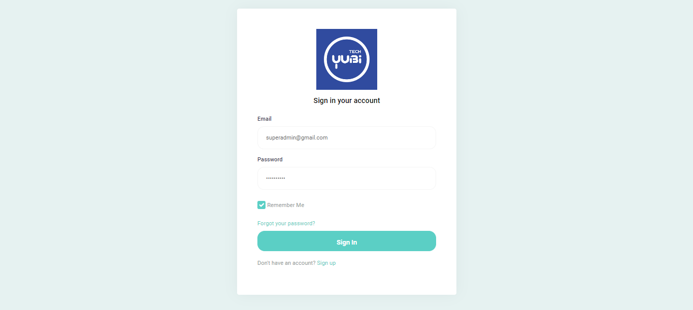

# Laravel X Inertia X Reactjs X TailwindCss

Dipergunakan untuk test kerja pada perusahan PT. Yubi Technology. aplikasi ini dibuat sendiri dari hasil experiment kerja WFH.
aplikasi di buat dalam bentuk monolith, namun RESTAPI dapat di pergunakan ke external melalui route /api dengan menggunkan JWT.
aplikasi dapat mengirimkan email yang telah di sertakan setting SMTP melalui server VPS sendiri untuk melakukan test email pada file env yang dipergunakan untuk register dan forgot password.

# Instalation

## Required

1. PHP (WAMPP/XAMPP)

```bash
#open terminal
php -v
#maka akan muncul versi php
```

2. Node Js Latest

```bash
#open terminal
node -v && npm -v
#maka akan muncul versi nodejs & npm
```

3. Database mysql/mariadb

## Download Aplikasi

1. Siapkan folder untuk aplikasi
2. Buka terminal di folder tersebut dan masukan printah

```bash
git clone https://github.com/nGincode/yubi.git
```

3. Lalu masuk ke folder aplikasi dengan di terminal

```bash
cd /yubi
```

4. Aplikasi berhasil didownload

## Create Database

1. Buat Database dengan nama apapun misal "myapp"
2. Edit .env data sesuai config dan nama database anda

```bash
DB_CONNECTION=mysql
DB_HOST=127.0.0.1
DB_PORT=3306
DB_DATABASE=myapp
DB_USERNAME=root
DB_PASSWORD=
```

3. Migrate database dengan memasukan printah

```bash
php artisan migrate:fresh --seed
```

4. Pada --seed untuk memasukan dummy data seperti akun super admin

## Run App

1. Pastikan anda berada di dalam folder app. ketikan perinta di terminal

```bash
php artisan serve
```

2. Buka browser di http://localhost:8000
   info : npm run dev (development) jika anda ingin mengubah atau jika telah selesai di ubah npm run build untuk file js

# Penggunaan Aplikasi

1. Pastikan aplikasi berjalan seperti berikut :

    

## Login

1. Klik login pada pojok kanan atas

    

2. Masukan email : superadmin@gmail.com dan Password : superadmin

    

3. Anda berhasil login sebagai admin yang nantinya akan di gunakan untuk control permission akses

    

4. Untuk logout kilik pada username superadmin pojok kiri atas di bawah logo yubi

    

## Register

1. Klik register pada pojok kanan atas

    

2. Isi data dengan benar termasuk email yang aktif

    

3. Setelah submit akan mendapatkan tampilan seperti ini :

    

4. Anda dapat cek email anda. jika terdapat pengetikan email salah maka dapat isi kolom Change Your Email

5. Cek pesan di kontak masuk email :

    

6. Klik verify email address

7. Anda berhasil membuat akun

    

8. Disini anda tidak memiliki izin akses menu maka menunggu pihak admin untuk membuat izin anda.

## Membuat Grups Permission (izin akses)

1. Login akun yang memiliki akses group seperti email: superadmin@gmail.com dan Password: superadmin

2. Lalu pergi ke menu account -> group

    

3. Isi data izin seperti contoh berikut :

    

4. Disana terdapat username yang belum memiliki akses pada target users, pilih username yang akan di buat. anda dapat menambahkan lebih dari 1 akun

5. Pada data display memungkinkan fungsi untuk menampilkan data secara private/akun sendiri, division, store atau keseluruhan

6. Setelah disimpan, maka terdapat menu baru sesuai izin yg dipilih, dan bisa melakukan sesuai yang di pilih

    

7. Lalu pemilik akun untuk melangkapi data contact

    

8. Setelah disimpan maka akun berhasil di buat dengan sempurna

    

## Forgot Password

1. Klik login pada pojok kanan atas

    

2. Klik forgot your password?

    

3. Masukkan email yang pernah terdaftar

    

4. Cek email anda

    

5. Klik reset password, lalu akan tampil

    

6. Isi password baru anda, lalu submit. dan anda akan diarahkan untuk login

## Store

Store merupakan nama perusahaan

## Users

Anda dapat membuat akun tanpa melalui proses verif email

## Semua proses memiliki Edit dan Hapus yang terlatak di bawah form input setiap menu pada kolom action


## Akses API

1. Anda harus register dan buat akun dan telah login
2. Akses url http://localhost:8000/mytoken
3. Copy token tersebut, Token tersebut merupakan Barear token yang di gunakan untuk akses data API External
4. Contoh url http://localhost:8000/api/users/all Method POST. Dapat menggunakan postman


## My history

1. Piepaid POS (CI4)


2. Piepaid Backoffice (CI4,Ajax,jQuery) terdapat fitur midtrans atau bayar online untuk berlangganan


3. Logistik POS, Order, Stock,Belanja dll (Laravel,Ajax,Jquery)


4. POS PRS (NextJs, ExpressJs)


5. Backoffice PRS (Laravel, Inertia, Reactjs)


6. PRS First App (CI3)


7. PRS Menu Control


8. Handle VPS Server Sampai Sekarang


Semua aplikasi sedang berjalan sampai sekarang

Terima kasih.. Dulu kuliah sambil kerja bagian IT
